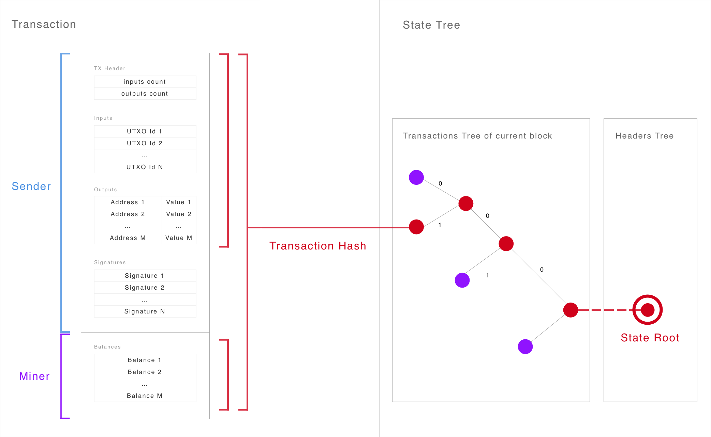

# Transactions

## Overview

## Address Balance
Miners accumulate the _balance_ ( sum of the values of the unspent outputs ) of an address in its most recent UTXO.

Thus we need to store only the most recent UTXO per address which reduces the growth of the UTXO set from O("number of transactions") to O("number of addresses"). Assuming Bitcoin's current state, we have [50 Million UTXOs](https://blockchain.info/charts/utxo-count) owned by only [500 000 unique addresses](https://blockchain.info/charts/n-unique-addresses) that's an improvement of 1:100.

- This reduces transaction sizes and therefore the network's load.
- Additionally this simplifies the usability because users do not have to combine multiple outputs from the same address efficiently.

#### Balance Proofs
By hashing balances into the transaction tree we get logarithmic balance proofs within the state tree. A user can update an outdated balance proof easily by appending the nodes to the root of the latest headers tree.

## UTXO References
In Bitcoin a transaction references its inputs by transaction hash + output id. Our output ids correspond to a proof and therefore we can use these 64 bit ids instead of 32 byte hashes. That's an improvement of 4x or about saving on average 40 bytes per transaction.

## Schnorr Signatures
We use [Schnorr signatures](https://github.com/WebOfTrustInfo/rebooting-the-web-of-trust/blob/master/topics-and-advance-readings/Schnorr-Signatures--An-Overview.md) because they are superior to the ECDSA algorithm (secp256k1) used in Bitcoin:
- More compact:
  - Size of public key: 32 bytes
  - Size of signature: 64 bytes
- Stronger security proof.
- Nice simplicity. They’re considered the simplest form of digital signature.
- Fast & efficient. They can be implemented in blindingly quick ways on Intel hardware.
- Nice aggregation properties for compact multi-signatures (i.e. see [Tree Signatures](https://blockstream.com/2015/08/24/treesignatures/)).

#### Further Resources
- [Schnorr Multi-Signatures](https://eprint.iacr.org/2018/068.pdf)
- [Key Aggregation](https://blockstream.com/2018/01/23/musig-key-aggregation-schnorr-signatures.html)
- [Peter Wuille's Talk on Schnorr Signatures for Bitcoin](https://www.youtube.com/watch?v=oTsjMz3DaLs)
- [Transaction Malleability](https://en.bitcoin.it/wiki/Transaction_malleability)
